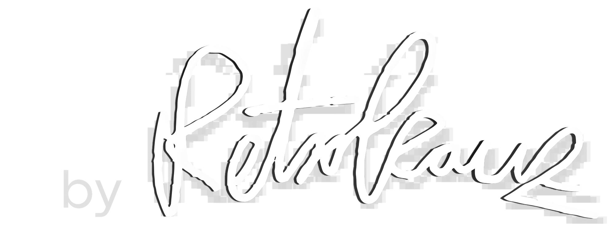

<div align="center">



# 🕹️ Retrokauz VICE Launcher

**Ein schlankes GUI-Frontend für den [VICE-Emulator](https://vice-emu.sourceforge.io/) — einfach knorke Retro.**


</div>

---

Kein Terminal-Gefrickel, keine Kommandozeilen-Flags auswendig lernen. Ein Klick, ein Emulator, ein Stück C64-Nostalgie. 💾

---

## 🎮 Unterstützte Emulatoren

| Button | Emulator | Executable |
|--------|----------|------------|
| X64sc | Commodore 64 (cycle-exakt) | `x64sc.exe` |
| C128 | Commodore 128 | `x128.exe` |
| VIC-20 | Commodore VIC-20 | `xvic.exe` |
| Plus/4 & C16 | Commodore Plus/4 & C16 | `xplus4.exe` |
| PET | Commodore PET | `xpet.exe` |
| C64 DTV | C64 Direct-to-TV | `x64dtv.exe` |
| SuperCPU64 | SuperCPU 64 | `xscpu64.exe` |
| CBM-II | CBM-II | `xcbm2.exe` |
| CBM-5x0 | CBM-5x0 | `xcbm5x0.exe` |

---

## ✅ Voraussetzungen

- **VICE** muss installiert sein → [Download vice-emu.sourceforge.io](https://vice-emu.sourceforge.io/)
- **Python 3.11+** (nur für den Quellstart / Build)
- **Pillow** (`pip install pillow`)

---

## 🚀 Schnellstart (Quellcode)

```bash
# 1. Repository klonen
git clone https://github.com/it-dennis/VICE-Launcher.git
cd VICE-Launcher

# 2. Virtuelle Umgebung erstellen und aktivieren
python -m venv venv
venv\Scripts\activate       # Windows
# source venv/bin/activate  # Linux / macOS

# 3. Abhängigkeiten installieren
pip install -r requirements.txt

# 4. Launcher starten
python retrokauz_launcher.py
```

Beim ersten Start wird VICE automatisch gesucht. Wird es nicht gefunden, öffnet sich ein Dialog zum Auswählen des `bin`-Ordners. Der Pfad wird dauerhaft gespeichert (unter `%APPDATA%\retrokauz\vice-launcher\config.json`).

---

## 📦 EXE bauen (Windows)

```bat
build.bat
```

Die fertige EXE liegt danach unter `dist\retrokauz_launcher.exe` und kann ohne Python-Installation weitergegeben werden. Logo, Icons und Themes werden automatisch eingebettet.

---

## 🎨 Themes

Im Ordner `themes/` befinden sich QSS-Stildateien (C64-Look, Pixel-Style). Die Themes werden zur Laufzeit geladen und können jederzeit angepasst werden.

---

## 📁 Projektstruktur

```ini
VICE-Launcher/
├── retrokauz_launcher.py   # Hauptprogramm
├── retrokauz_launcher.spec # PyInstaller-Konfiguration
├── requirements.txt
├── build.bat               # Windows-Build-Skript
├── build.sh                # Linux/macOS-Build-Skript
├── icons/                  # Button-Icons
├── logo/                   # Logo-Grafiken
├── favicon/                # Fenster-Icon
├── themes/                 # QSS-Themes + Token-Datei
└── landingpage/            # Statische Projektseite (HTML)
```

---

## 📜 Lizenz

GNU GPL v3 – siehe [LICENSE](LICENSE).

VICE selbst steht unter der **GNU GPL v2+** und wird vom VICE-Team entwickelt.
Dieses Projekt ist kein offizielles VICE-Produkt und steht in keiner Verbindung zum VICE-Team.

---

<div align="center">

*Erstellt von [Dennis Rapp (Retrokauz)](https://dennisrapp.com)* 🖥️

</div>
